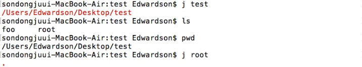

## autojump?

터미널에서 본인이 원하는 디렉토리로 이동하려고 할때, 디렉토리를 차례차례 건너가면서 이동하는 방법과 절대경로를 통해 한번에 이동하는 방법이 있다.

하지만 이들 모두 사용자에게 상당한 불편을 줍니다 ㅠㅠ 저도 맥을 쓴지 얼마 안돼서 상당한 불편함이 있더라구요.

이걸 바로 해결해 줄수있는게 autojump입니다.

## 어떻게 동작하는건가요?

바로 실행 스샷 들어갑니다.


요런식으로 바로 이동이 가능해요!! 절대 경로나 cd같은 시스템 함수를 쓰지 않아도 바로 해당 디렉토리로 이동가능!!!!


일단 대충 어떻게 돌아가는건지 감은 잡았으니 설치부터 찬찬히 살펴보죵~~

## Info

**NAME**

​       autojump - a faster way to navigate your filesystem

   **DESCRIPTION**

​       autojump  is  a  faster  way  to navigate your filesystem.  It works by

​       maintaining a database of the directories you use  the  most  from  the

​       command line.

​       **Directories must be visited first before they can be jumped to.**

**<autojump는 터미널상에서 한번 방문 했던 위치로만 jump할수 있어요!!>**

   **USAGE**

​       j  is  a convenience wrapper function around autojump.  Any option that

​       can be used with autojump can be used with j and vice versa.

​       o Jump To A Directory That Contains foo:

​                j foo

​       o Jump To A Child Directory:

​         Sometimes it's convenient to jump to a child directory (sub-directory

​         of current directory) rather than typing out the full name.

​                jc bar

​       o Open File Manager To Directories (instead of jumping):

​         Instead  of jumping to a directory, you can open a file explorer win-

​         dow (Mac Finder, Windows Explorer, GNOME Nautilus, etc.) to  the  di-

​         rectory instead.

​                jo music

​         Opening a file manager to a child directory is also supported:

​                jco images

​       o Using Multiple Arguments:

​         Let's assume the following database:

​                30   /home/user/mail/inbox

​                10   /home/user/work/inbox

​         j in would jump into /home/user/mail/inbox as the higher weighted en-

​         try.  However you can pass multiple arguments to autojump to prefer a

​         different  entry.  In the above example, j w in would then change di-

​         rectory to /home/user/work/inbox.


## How to Installation

저는 OSX를 사용중이기 때문에 Home brew를 통해 간편하게 설치해 볼꺼에요 ㅎㅎ

우선 터미널상에서 brew search autojump   를 해서 해당 패키지가 있는지 검색해 볼거에요


검색해 보니 패키지 중에 autojump 가 존재 하네요 그럼 이제 설치만 해주면 됩니다!!

그럼 이제 brew install autojump를 해주세요


아니?!!! 에러가 뜨네요?....찝찝 합니다...

그냥 설치를 진행해도 되지만 저는 찝찝한걸 못참는 관계로 한번 해결을 해 보겠습니다.

터미널 상에서 친절하게 brew를 update를 하라고 나오네요.

하지만 우리에겐 구글이 있기때문에 유사한 사례가 있는지 검색해볼께요


[출처 : <http://developpeers.com/blogs/fix-for-homebrew-permission-denied-issues>]

다행히 비슷한 사례가 있었네요. 아무래도 권한 설정때문에 링크가 제대로 돼지 안는 문제가 있었나봐요.

자그럼 차근차근 해결해 보죵.

아쉽지만 autojump는 먼저 uninstall 하고 시작할께용

```shell
$ brew uninstall autojump
```

이제 brew를 업데이트 해볼까요?

```bash
brew upgrade
brew cleanup
brew install autojump
brew link --overwrite autojump
sudo chown -R 'whoami' /usr/local
brew install autojump
```

고대로 입력해 줍니다~~


오오오~~!!!에러 없이 잘 돌아가네용~~ 그럼 이제 설치가 완료 되었나 확인해봐야겠죠?

터미널에 autojump를 쳐줍니다.


아니?!!!!!!?!?!?!?!!!!

"아니!! 니가 하라는데로 다 했는데 저건 뭐야?!!?!?!!!"

하시는 분들 있을테지만 ㅎㅎ 아직 끝나지 안았습니다.


출처 : https://github.com/wting/autojump

autojump의 git페이지를 살펴보면 매뉴얼이 나와있네요~~ 한번 해봅시다.

터미널에 autojump 디렉토리로 이동해서 install.py를 실행 시킬꺼에용!!


뭔가 설치가 완료되어가는 느낌이 팍팍 듭니다.

하지만 아직 끝나지 안았어요!!!

왜냐면요, 현재 여러분이 사용하고 계시는 쉘에서 autojump를 사용하기 위해선

쉘의 환경변수를 설정해줘야 해요.

그래서 autojump를 설치할때 Please하면서 뭐라뭐라 하네용

자세히 한번 봅시다.


ㅇㅇ....

ㅇㅋ......

뭘 profile에 추가하라고 하네요. 바로 환경변수에 autojump를 쉘상에서 바로 실행할수 있게 코드를 추가해주라는 내용이에요!!

그럼 이제 추가해 볼까요?

저는 Mac을 사용중이니까 .bash_profile에 등록 할꺼에요

그럼 이제 

vi ~/.bash_profile

을 해서 열어 볼까요?


자그럼 위에 autojump 설치시에 나왔던 추가하라던 코드부분을 추가해주면 됩니다!!

그리고 꼭 저장 잊지 마세요~

자그럼 이제 실행이 되는건가 확인해 봐야겠죠?

바로 터미널에 autojump 써봅시다!


오~~?!!오오오~~!!!!! 잘되는듯 싶은데 또 사용법은 알고 가야하잔아요?

그럼 예시 몇개 보고가시죠!!


## Usage

저는 현재 test -> foo, root 이런식으로 디렉토리를 구성해 봤어요

현재 위치는 test이구요

자 그럼 foo 로 이동해 볼까요?

사용법은 j [디렉토리명]

이런식으로 사용하면 돼요!!


오~~~잘 작동하네용 그럼 root로 한번 이동해봐야겠죠?



잉???!!!왜 안될까요? 이상하네요....가 아니라

autojump는 자신이 한번 방문했던 디렉토리만 점프 가능하다는점!!!!

때문에 저는 j -a /User/Edwardson/Desktop/test/root

를 해줘서 경로를 입력해 줄꺼에요. 자그럼 이동 하나 확인해봐야겠죠?


매우매우 잘 이동되네용 ㅎㅎ


## Issue

autojump를 사용하면서 몇가지 문제점들을 발견했어요!!

첫번째, 같은 이름을 갖는 디렉토리

예제를 한번더 만들어 봤어요 stat을 보면 알겠지만 현재 디렉토리 안에 qwe라는 디렉토리는 3개가 있어요.

각각이 weight도 전부 다르구요. 중복된 이름이 존재할때는 어떻게 이동해야 할까요?


밑의 예제를 살펴보죠


눈치 채셨나요?만약 test에 있는 qwe로 이동하기위해선

j test/qwe

이런식으로 입력해줘야 해요!!

나머지 qwe들은 하위 디렉토리이므로

j w in qwe

를 해주면 하위 디렉토리들끼리 갖고있는 qwe 간의 이동이 되용

뭔가 복잡하네요....

두번째, 디렉도리의 경로가 저장될텐데 경로들이 너무 많이 저장되어서 복잡할때 해당 경로들을 지워야해요

autojump의 데이터 베이스는 밑의 위치에 있어요.


해당 txt파일을 오픈 하면


이런식으로 제가 이동했던 경로들이 저장되어 있어요.

만약 경로가 너무 많아 지거나 정리를 하고 싶을때 자유롭게 삭제하시면 됩니다~~

혹시라도 다른 이슈에대에 궁금하시면

[여기](https://github.com/joelthelion/autojump/issues)를 참고해 주세요~

그럼 저는 이만 autojump에 대한 글을 마칠께요!!!!

다들 편리한 기능 사용해서 어려움 없으시길 바래용~~

감사합니다~~~


