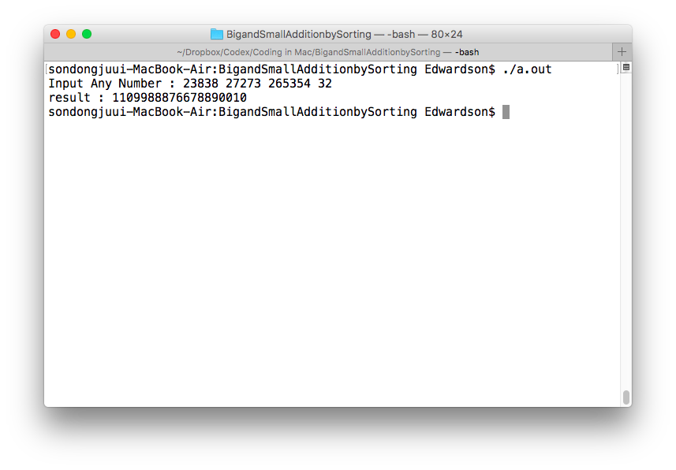

## 문제

- 임의의 수를 입력 받아 큰수와 작은수로 정렬한후 덧셈을 함.


## 필요 자료구조 및 알고리즘

- ASCII Code를 통한 계신(키보드 입력및 파일 입출력)
- Bubble Sorting
- Binary Addition Algotirthm


## 설계

- KeyBoard Input or File Input Processing
- Dynamic Allocation for Big&Small Integer
- Bubble sort for Big&small integer
- Binary Addition Algorithm


## 구현

- Input Any Number : 원하는 아무 숫자를  Space로 구분지어 입력합니다.
- Result : Space로 입력된 숫자들을 오름차순 내림차순으로 정렬되어 Binary Addition이 됩니다.

```c
#include <stdio.h>
#include <string.h>
#include <stdlib.h>
#include <time.h>
#include <sys/time.h>
#define MAX_STR_SIZE 100
void bubble(char a[], int n);
void rebubble(char b[], int n);
void swap(char *, char *);
void showstream(char a[]);
void sum(char big[],char small[]);
void reverse(char a[]);
void ncarry(int n,int end);
void whatbubblein(char a[],char b[]);
void input_string();
char result[MAX_STR_SIZE];
char str_before[MAX_STR_SIZE];

int main() {
	char str_after[MAX_STR_SIZE];
	printf("Input Any Number : ");
	input_string();
	strcpy(str_after,str_before);
	bubble(str_before,(int)strlen(str_before));
	rebubble(str_after,(int)strlen(str_before));
	sum(str_before,str_after);
	reverse(result);
	printf("result : ");
	showstream(result);
	return 0;
}

void input_string(){
	char str_after[MAX_STR_SIZE];
	char str_read[MAX_STR_SIZE];
	int i,j,k=0;
	fgets(str_read , MAX_STR_SIZE,stdin);
	for (int i = 0; i < strlen(str_read); ++i)
	{
		if(str_read[i]==10){
			str_before[k] ='\0';
		}

		if(str_read[i]!=32 && str_read[i]!=10){  //32 space bar
			str_before[k]=str_read[i];
			k++;
		}
	}
}

void bubble(char a[], int n)		
{        /* n is the size of a[] */

	int i, j,k;
	for (i = 0; i < n - 1; ++i){
		for (j = n - 1; j > i; --j){
			if (a[j-1] > a[j]){
				swap(&a[j-1], &a[j]);
			}
		}
	}
}

void rebubble(char b[], int n){
	int i,j,k=0;
	for (i = 0; i < n - 1; ++i){
		for (j = n - 1; j > i; --j){
			if (b[j-1] < b[j] ){
				swap(&b[j-1], &b[j]);
			}
		}
	}
}

void swap(char *p,char *q){
	static char cnt=1;
	char temp=*p;
	*p=*q;
	*q=temp;
	cnt++;
}

void showstream(char a[]){
	puts(a);
}

void sum(char big[],char small[]){
	char temp[MAX_STR_SIZE];
	int i,j,k;
	static int count=0;
	int leng,carry=0;
	leng = (int)(strlen(big));
	for (int i = 0; i < leng; ++i)
	{

		temp[i]=(big[leng-1-i]+small[leng-1-i])-48;
		if(carry==1){
			result[i]=1+temp[i];
			carry = 0;
			if(result[i]>=58){
				result[i]=result[i]-10;
				result[i+1]=result[i+1]+49;
				ncarry(count,i);
				carry=1;
			}
		}
		else{
			if(temp[i]>=58){
				result[i]=temp[i]-10;
				carry=1;
				ncarry(count,i);
			}
			else{
				result[i]+= temp[i];
			}
		}
		count++;
	}
}

void reverse(char a[])
{
	char temp[MAX_STR_SIZE];
	int x;
	x=strlen(a);
	for(int n=x-1;n>=0;n--)
	{
		temp[x-n-1]=a[n];
	}
	temp[x]='\0'; 
	strcpy(result,temp);
}

void ncarry(int n,int end){
	if(n==end){
		result[n+1]='1';
	}
	else{
		result[n+1]=result[n+1]+1;
	}
}

void whatbubblein(char a[],char b[])
{	int i,leng;
	leng = (int)(strlen(a));
	printf("bubble :\t");
	for (int i = 0; i <leng; ++i)
	{	
		printf("[%d]:%d(%c)  ",i, a[i],a[i]);
	} 
	printf("\nrebubble :\t");
	for(i= 0; i <leng;i++)
	{
		printf("[%d]:%d(%c)  ",i, b[i],b[i]);
	}
	printf("\n");

}

```
## Refference

[숫자 알고리즘](https://people.eecs.berkeley.edu/~vazirani/algorithms/chap1.pdf)
## 회고

필요 이상의 쓸데없는 코드가 많은것 같습니다. ㅠ.ㅠ

더 공부해서 코드를 잘 모르는 사람도 쉽게 보고 이해할수있는 코드를 짤수 있게 노력하겠습니다.

 

 

