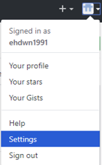
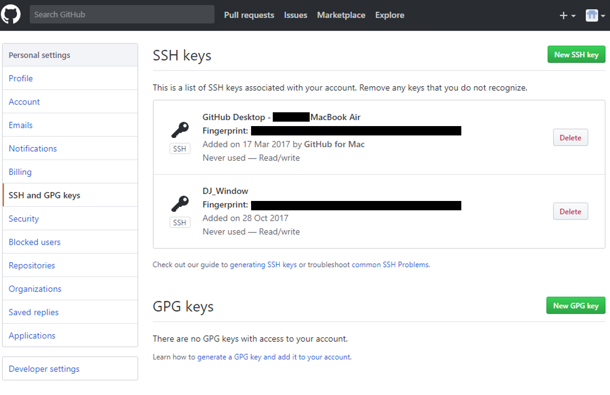
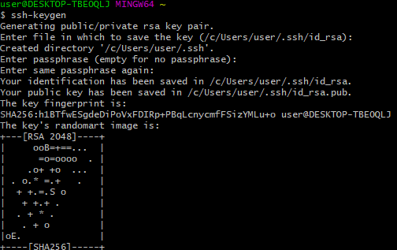
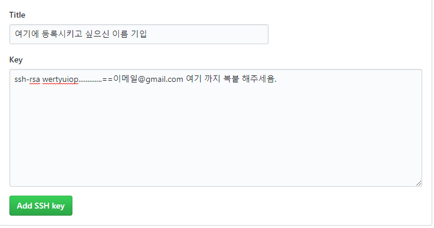

* .
{:toc}


다들 Git-Hub를 사용해보려 하는데 힘든 부분들이 많죠?ㅠㅠ

저도 처음 접할때는 어떻게 동작하는지도 모르고 무작정 맨땅에 헤딩...

아무튼 지금쯤 검색하셔서 들어오신거면, 깃허브에 가입은 완료 했고

아마 repository 까지는 생성 하셨을거 같아요.

이제 본격적으로 로컬에서 깃허브에 파일을 업로드 하는 방법을 포스팅 하려고 합니다.

제가 Mac os를 쓸때는 바로 터미널에서 깃을 설치하여서 사용했는데요.

Window에서 저는 Git Bash를 사용했습니다. 아무래도 터미널 사용에 적응이 되서 Bash가 편하드라구요.


## Git Bash 설치

Bash 설치는[ https://git-for-windows.github.io/](https://git-for-windows.github.io/) 에서 설치할수 있어요.

설치시에 따로 설정하는건 없으니 우선 가볍게 설치먼저 해주시구요.


## SSH Key생성 및 등록

우선 본인의 깃허브에 로그인해서 오른쪽 상단에 집 모양 아이콘이 있어요.



그리고 Settings에 들어가고 나면 SSh and GPG KEY 라는 칸이 보일꺼에요



저는 맥 에어도 등록 했고 윈도우에서도 등록을 해놔서 두개의 SSH 키가 있네요.

SSH 키는 자동 로그인 같은 기능이라고 생각하시면 되요.

작업하는 컴퓨터에서 깃에 업로드 할때마다 불필요한 로그인을 할필요가 없어요.


## Git Bash 초기 설정

이제 여러분들이 설치한 Git Bash를 실행해서 로그인 정보를 등록할꺼에요.

```shell
$ git config --global user.name <이름> 
ex)git config --global user.name Codex


$ git config --global user.email <이메일> 
ex)git config --global user.email Codex@gmail.com
```

이런식으로 bash에서 등록을 해줍니다.


## SSH KEY 생성 

Git-Hub에 제 SSH Key를 등록 할꺼에요.

그전에 SSH Key를 생성해야겠죠?

bash에 ssh-keygen 을 입력해 주세요.

```shell
$ssh-keygen
```



그럼 요렇게 생성이 될꺼에요.

Key를 생성하면 .ssh 라는 숨김 폴더가 생성되고

그안에 두가지 파일이 생성될꺼에요.

id_rsa, id_rsa.pub

자 그럼 생성이 제대로 되었는지 확인해 볼까요?

bash에서 ssh key가 있는 디렉토리로 이동을 해야해요.

```shell
$ cd C:/users/user/.ssh
```

보통 위치가 C:\Users\사용자계정\.ssh 이곳에 있어욤.

자 그럼 위치도 확인 했으니 id_rsa.pub 의 내용은 복사해서 Git의 SSH Key에 등록해줘야 해요.

간단하게 Bash상에서 vi id_rsa.pub 을 해주셔서 내용을 복사하셔도 되구요.

```shell
$ cat id_rsa.pub 을 해주셔도 됩니다.
```

아무튼 id_rsa.pub에 나오는 모든 내용을 복사해 주세요.

ssh-rsa 부터 맨 마지막에 본인의 이메일 주소가 나온곳까지 복사해 주세요.


## SSH KEY 등록

Git-Hub등록을 해줄 차례에요.

저번처럼 Setting에 들어오셔서 ssh key를 추가하시면



요롷게 간단하게 추가해주시면 됩니다.

마지막으로 Add SSH key를 눌러주시면 완료!!!

그럼 다음 포스팅에서 본격적으로 Git에 업로드 하는법을 올려볼께요~~

읽어주셔서 감사하고, 언제나 화이팅 하세요~~

궁금하신것은 언제든 댓글로 물어봐주세요~~

 


