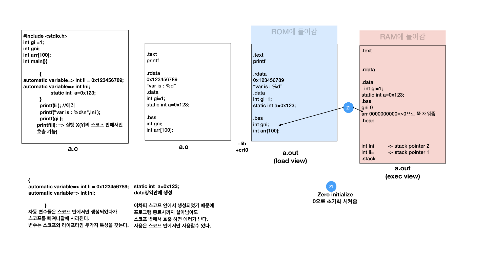
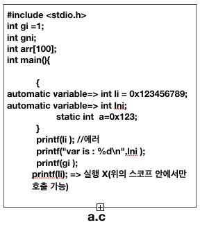
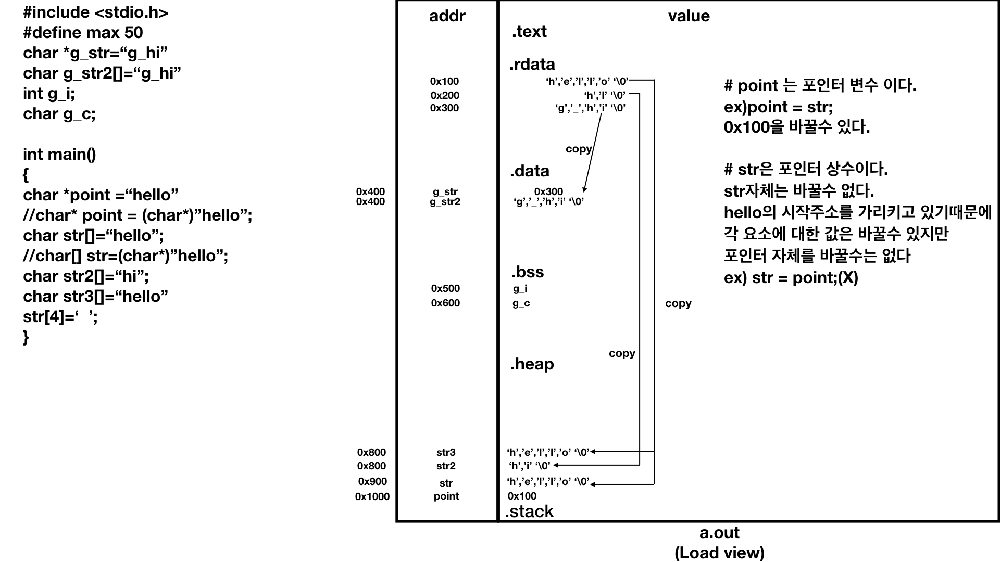

## T32_simarm 예제
> 윈도우 에서 돌려야함. 맥에서 설치 가능 하긴 하나 아직은 필요 없는듯
1. t32marm.exe 실행
2. 나온창 다 닫고 밑으 콘솔에
  B:: RES
  B:: D.L
  B:: R
  B:: D.DUMP 0X20000000
  B:: D.LOAD .ELF *
3. 창하나 뜨면 ex 폴더의 image 파일 열기 (반드시 image여야함 .bin 이런거 말고)
4. F9 누르면 기계에 를 와따가따함
5. F3 누르면 다음 단계 진행
6. BL Main에 다다르면 F2해서 프로그램 실행이됨


## Memory structure
[여기를 보며 참고해보자](http://faculty.salina.k-state.edu/tim/CMST302/study_guide/topic4/storage_class.html)

```scheme
//stored in memory
.text
실행 가능한 명령어들이 저장된다.
.rodata(rdata,const) =>rodata(read only data)
constant, literal & symbolic constant 등이 저장된다.
.data
초기화 전역 변수
.bss
초기화 되지 않은 전역 변수
.heap
사용자 동적 메모리
.stack
지역 변수
```


> Texas instrument에 보면 각 section에 대해 이렇게 정의 되어 있다.
>
>  Initialized sections: .text, .const, .cinit, and .switch
>
> Uninitialized sections: .bss, .stack, and .sysmem
>
> • .text -- Used for program code.
>
> • .bss -- Used for uninitialized objects (global variables).
>
> • .data -- Used for initialized non-const objects (global variables).
>
> • .const -- Used for initialized const objects (string constants, variables declared const).
>
> • .cinit -- Used to initialize C global variables at startup.
>
> • .stack -- Used for the function call stack.
>
> • .sysmem - Used for the dynamic memory allocation pool.


###  Text Section

The text section of the program contains the executable instructions of the program. Thus, the program instruction counter is a pointer into the text section. Constants, such as the string constants of a [printf()](http://faculty.salina.k-state.edu/tim/CMST302/study_guide/topic1/IO.html#printf) statement are also stored in the text section of memory.

###  Data Section

The data section of memory if for global and static data that is initialized when declared. Since, the initial value of initialized variables is known in advance, all global or static variables are saved together in the executable file and the data block is loaded into memory directly from the executable file just like the text section.

###  Bss Section

The bss section, like the data section, is for storing global and static variables. The difference being that the bss section stores variables that were not initialized to a specific value when declared. Bss data is initialized to zero when the program starts.

###  Stack Section

The stack stores various pointer values which are needed for the execution of the program and also is the default storage location for variables which are local to a function, i.e., declared within the body of the function. The stack data is created when program begins a function and is destroyed when that function exits. When the running function call another function, the new function’s data is pushed in front of the original function’s data.


### Memory section

> 프로그램이 run 할때까지의 memory section에 대한 이해를 해야한다.
>
> 사실 프로그램이 실행될때의 memory 구조를 주의깊게 보자.




* a.c



  a.c를 살펴 보면 code block 내에 존재하는 code들이 있다.

  ```c
  int li = 0x123456789;
  int lni;
  //두 변수의 설명에 automatic variable 이라고 설명 되어 있다.
  ```

Automatic variable 이란 특정 scope내에서 자동 생성 되어 stack에 저장되었다가

scope 를 빠져 나가면 stackd에서 자동 삭제 된다.

따라서 automatic variable들의 life time은 scope 를 벗어 날때 까지 이다.

  

* Load view & Exec view


<center>Load and Exec view</centet>

Load view : a.out이 실행되기 이전에 ROM에 저장되어 있는 상태이다.

Exec view : a.out이 실행되서 RAM에 올라가 있을때 이다.

Zero Initialization : 초기화 되지 안은 전역 변수, 배열을 초기화 해준다.


* Memory segment example

