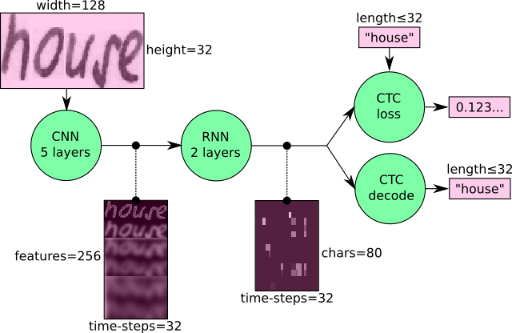
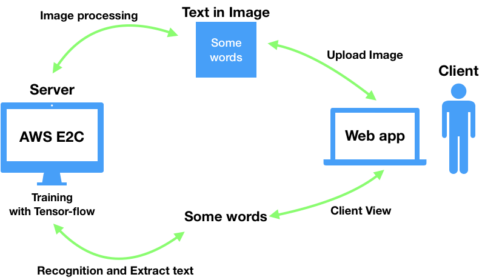

# Handwritten Text Recognition

> Tensorflow 를 이용하여, 사진속의 글자(Alphabet) 인식후 추출

## Intro

Deep learning Project의 일환으로 정적 이미지 처리에 대한 이해도를 높이는데 주안점을 두었습니다.

프로젝트를 진행하면서 Tensorflow, Deep learning, Image processing, Open CV,

Text Classification, AWS 등을 대한 활용합니다. 

이미지속에 있는 문자를 하나의 객체로 추출해내는것이 목표입니다.

> 해당 프로젝트는 Full Stack Development 를 어느정도 체험해 보고 한발짝 다가가는 계기로써 진행하려 합니다.

## Goal

- Build AWS E2C Sever

  AWS의 E2C를 활용하여, linux 서버를 구축합니다.

  

- Image processing with tensorflow, Open CV in Python

  서버 상에서 Text image processing을 위해 약 3천 장의 Image를 learning시킵니다.

  

- Basical Web app for Client side

  사용자로 하여금 글자가 있는 사진 파일을 서버로 전송후, 

  이미지에서 추출된 글자를 사용자가 볼수 있는 Web app에서 확인 합니다.

## Requirement & Environment

> OS : OSX, Ubuntu 16.04 LTS
>
> Server side : AWS E2C(Ubuntu server), Tomcat, Docker
>
> Editor : Sublime text
>
> Language : Python 3.6
>
> Tool :  Jupyter notebook,
>
> Framework : Django
>
>  SCM : Git

#### 참고

[프로젝트 주소]()

[Django 파일 업로드](https://cjh5414.github.io/django-file-upload/)

[이미지 추출 python project](https://towardsdatascience.com/build-a-handwritten-text-recognition-system-using-tensorflow-2326a3487cd5)

[Django Git book 한글 번역](https://tutorial.djangogirls.org/ko/)

[Tensor-flow 한글 번역](https://tensorflowkorea.gitbooks.io/tensorflow-kr/content/)

[MNIST 문자인식-숫자 ](http://solarisailab.com/archives/303)

[Text data set - git hub](https://github.com/cs-chan/Total-Text-Dataset)

[OpenCV guide](https://www.pyimagesearch.com/2018/07/19/opencv-tutorial-a-guide-to-learn-opencv/)

[네이버 랩 사진속 글자 검출](https://d2.naver.com/helloworld/8344782)

